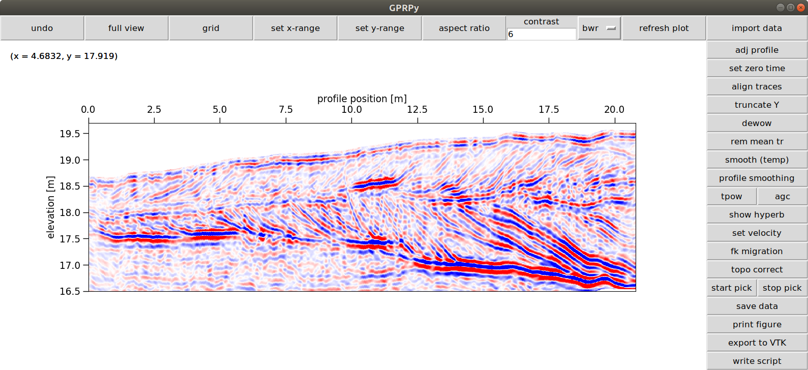
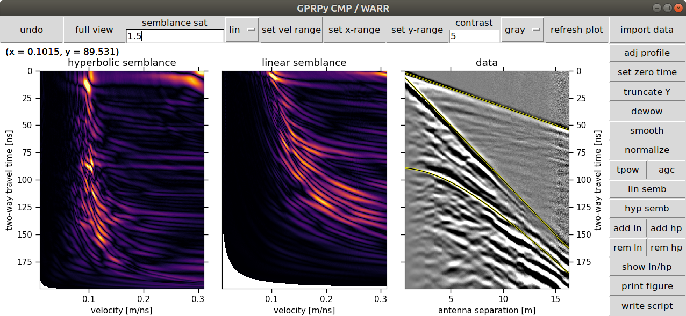

# GPRPy
Open-source Ground Penetrating Radar processing and visualization software. Supported by the National Science Foundation under grants [EAR-1550732](https://www.nsf.gov/awardsearch/showAward?AWD_ID=1550732) and [EAR-2022671](https://www.nsf.gov/awardsearch/showAward?AWD_ID=2022671)

Please cite https://library.seg.org/doi/10.1190/tle39050332.1

## Simplemost installation using anaconda python

1) Download the GPRPy software from 
   [https://github.com/NSGeophysics/GPRPy/archive/master.zip](https://github.com/NSGeophysics/GPRPy/archive/master.zip).  
   Save the file somewhere on your computer and extract the zip folder.  
   As an **alternative**, you can install git from [https://git-scm.com/](https://git-scm.com/), then run in a command prompt: 
   `git clone https://github.com/NSGeophysics/GPRPy.git` 
   The advantage of the latter is that you can easily update your software by running from the GPRPy folder in a command prompt: 
   `git pull origin master`

2) Install anaconda or miniconda [https://www.anaconda.com/download](https://www.anaconda.com/download)

3) Once the installation finished, open a command prompt:
   On Windows: click on Start, then enter "Anaconda Prompt", without the quotation marks into the "Search programs and files" field.
   On Mac or Linux, open the regular terminal. In the command prompt/terminal, run 
   `conda activate` 

5) Change to the directory  where you downloaded the GPRPy files.
   This is usually through a command like for example 
   `cd Desktop\GPRPy` 
   if you downloaded GPRPy directly onto your desktop. Then type the following and press enter afterward: 
   `python installMigration.py` 
   Then type the following and press enter afterward: 
   `pip install .` 
   **don't forget the period "." at the end of the `pip install .` command**

## Running the software
After installation, you can run the script from the Anaconda Prompt (or terminal after running `conda activate`) by running 
`gprpy` 

The first time you run GPRPy it could take a while to initialize. GPRPy will ask you if you want to run the profile [p] or WARR / CMP [c] user interface. Type 
`p` 
and then enter for profile, or 
`c` 
and then enter for CMP / WARR.

You can also directly select one by running either 
`gprpy p` 
or 
`gprpy c` 

## Running automatically generated scripts
To run automatically generated scripts, open Anaconda Prompt (or the terminal and run `conda activate`), switch to the folder with the automatically generated script and run 
`python myscriptname.py` 
where myscriptname.py is the name of your automatically generated script. Note that the data need to be in the directories referenced by `myscriptname.py`. 

## Uninstalling GPRPy
To uninstall GPRPy, simply run, in the Anaconda Prompt (or terminal after `conda activate`) 
`pip uninstall gprpy`

## News
Follow [@GPRPySoftware](https://twitter.com/GPRPySoftware) on twitter to hear about news and updates.
Recent tweets:

<blockquote class="twitter-tweet" data-lang="en">
Fixed small issue that led to multiples when picking points in profile. Thanks Marcus Pacheco for pointing it out! If you use picking in profile mode, please update to version 1.0.3 (uninstall the old version before).
&mdash; GPRPy (@GPRPySoftware) <a href="https://twitter.com/GPRPySoftware/status/1139243564469313536?ref_src=twsrc%5Etfw">June 13, 2019</a></blockquote>

<blockquote class="twitter-tweet" data-lang="en">
I will post updates, changes, and GPRPy news here.
&mdash; GPRPy (@GPRPySoftware) <a href="https://twitter.com/GPRPySoftware/status/1089246592786485251?ref_src=twsrc%5Etfw">January 26, 2019</a></blockquote>

<blockquote class="twitter-tweet" data-lang="en">
GPRPy is a free ground penetrating radar processing and visualization software developed at the University of Alabama. You can download it and install it following the instructions here: <a href="https://nsgeophysics.github.io/GPRPy/">nsgeophysics.github.io/GPRPy/</a>
&mdash; GPRPy (@GPRPySoftware) <a href="https://twitter.com/GPRPySoftware/status/1088806792191197188?ref_src=twsrc%5Etfw">January 25, 2019</a></blockquote>

